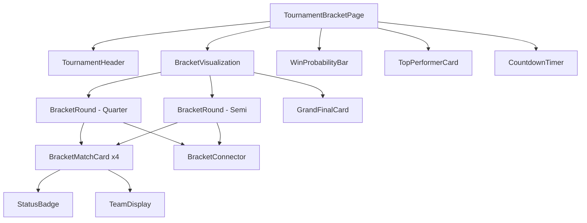
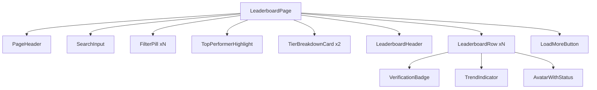
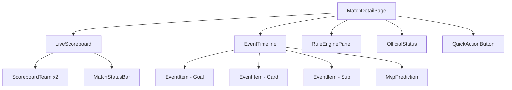
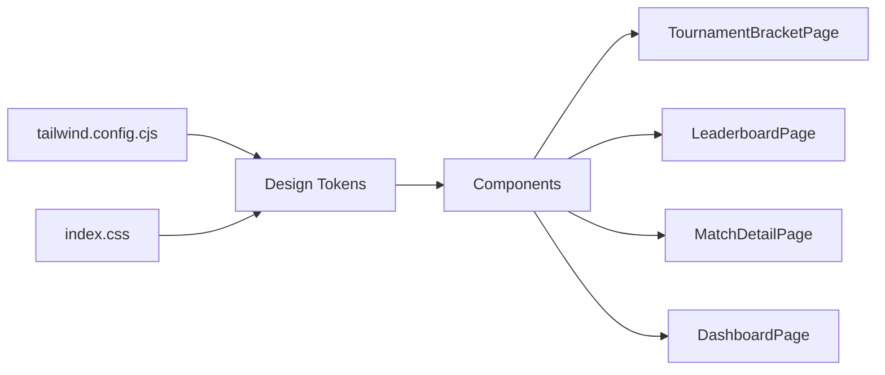

# Component Mapping Strategy for Frontend Update

## Overview
This document provides a comprehensive analysis of the reference UI files and current components, with a detailed mapping strategy for updating the frontend to match the AGS Global Arena design system.

---

## 1. Design Token Extraction

### 1.1 Color Palette

#### Primary Colors
| Token | Hex Value | Usage |
|-------|-----------|-------|
| `primary` | `#c8c6c5` | Main primary color |
| `primary-container` | `#121212` | Primary container background |
| `primary-fixed` | `#e5e2e1` | Fixed primary variant |
| `primary-fixed-dim` | `#c8c6c5` | Dim fixed primary |
| `on-primary` | `#313030` | Text on primary |
| `on-primary-container` | `#7e7d7d` | Text on primary container |
| `inverse-primary` | `#5f5e5e` | Inverse primary |

#### Secondary Colors (Cyan/Teal Accent)
| Token | Hex Value | Usage |
|-------|-----------|-------|
| `secondary` | `#bdf4ff` | Main secondary |
| `secondary-container` | `#00e3fd` | Secondary container |
| `secondary-fixed` | `#9cf0ff` | Fixed secondary |
| `secondary-fixed-dim` | `#00daf3` | Dim fixed secondary |
| `on-secondary` | `#00363d` | Text on secondary |
| `on-secondary-container` | `#00616d` | Text on secondary container |

#### Tertiary Colors (Gold/Yellow)
| Token | Hex Value | Usage |
|-------|-----------|-------|
| `tertiary` | `#e9c400` | Main tertiary |
| `tertiary-container` | `#c9a900` | Tertiary container |
| `tertiary-fixed` | `#ffe16d` | Fixed tertiary |
| `tertiary-fixed-dim` | `#e9c400` | Dim fixed tertiary |
| `on-tertiary` | `#3a3000` | Text on tertiary |
| `on-tertiary-container` | `#4c3f00` | Text on tertiary container |

#### Surface Colors (Dark Theme)
| Token | Hex Value | Usage |
|-------|-----------|-------|
| `background` / `surface` | `#131313` | Main background |
| `surface-dim` | `#131313` | Dim surface |
| `surface-container-lowest` | `#0e0e0e` | Lowest container |
| `surface-container-low` | `#1c1b1b` | Low container |
| `surface-container` | `#201f1f` | Default container |
| `surface-container-high` | `#2a2a2a` | High container |
| `surface-container-highest` | `#353534` | Highest container |
| `surface-variant` | `#353534` | Surface variant |
| `surface-bright` | `#393939` | Bright surface |

#### Outline & Border Colors
| Token | Hex Value | Usage |
|-------|-----------|-------|
| `outline` | `#8e9192` | Main outline |
| `outline-variant` | `#444748` | Variant outline |

#### Error Colors
| Token | Hex Value | Usage |
|-------|-----------|-------|
| `error` | `#ffb4ab` | Error color |
| `error-container` | `#93000a` | Error container |
| `on-error` | `#690005` | Text on error |
| `on-error-container` | `#ffdad6` | Text on error container |

### 1.2 Typography

| Role | Font Family | Weights | Usage |
|------|-------------|---------|-------|
| `headline` | Space Grotesk | 300, 400, 500, 600, 700 | Headings, titles, numbers |
| `body` | Inter | 300, 400, 500, 600, 700 | Body text, descriptions |
| `label` | Space Grotesk | 300, 400, 500, 600, 700 | Labels, badges, small text |

**Font Loading:**
```html
<link href="https://fonts.googleapis.com/css2?family=Space+Grotesk:wght@300;400;500;600;700&family=Inter:wght@300;400;500;600;700&display=swap" rel="stylesheet"/>
```

### 1.3 Spacing & Border Radius

| Token | Value | Usage |
|-------|-------|-------|
| `border-radius-DEFAULT` | `0.125rem` (2px) | Default border radius |
| `border-radius-lg` | `0.25rem` (4px) | Large border radius |
| `border-radius-xl` | `0.5rem` (8px) | Extra large border radius |
| `border-radius-full` | `0.75rem` (12px) | Full border radius |

### 1.4 Gradients

```css
.technical-gradient {
    background: linear-gradient(135deg, #121212 0%, #353534 100%);
}
```

### 1.5 Special Effects

```css
.glass-panel {
    background: rgba(53, 53, 52, 0.6);
    backdrop-filter: blur(12px);
}

.glow-cyan {
    text-shadow: 0 0 10px rgba(0, 229, 255, 0.4);
}
```

### 1.6 Scrollbar Styling

```css
::-webkit-scrollbar { width: 4px; height: 4px; }
::-webkit-scrollbar-track { background: #131313; }
::-webkit-scrollbar-thumb { background: #2A2A2A; border-radius: 2px; }
::-webkit-scrollbar-thumb:hover { background: #00E5FF; }
```

---

## 2. Component Inventory

### 2.1 Existing Components Analysis

#### MetricCard.tsx
**Current State:**
- Uses slate color scheme
- Rounded-3xl border radius (too round)
- Simple label/value display

**Required Changes:**
- Update colors to use design tokens (`surface-container-lowest`, `on-surface`)
- Change border radius to `border-l-2` or `rounded-lg` per reference
- Add accent border left option
- Use `font-headline` for values, `font-label` for labels
- Add tracking-widest for labels

**New Props Needed:**
- `accentBorder?: boolean` - Left border accent
- `variant?: 'default' | 'highlighted'` - Visual variant

---

#### StatusBadge.tsx
**Current State:**
- Uses cyan-500, slate-700, slate-600, slate-500
- Rounded-full with tracking-[0.18em]

**Required Changes:**
- Map status types to new color tokens:
  - `live` → `secondary-container` bg, `on-secondary` text
  - `scheduled` → `surface-container-high` bg, `on-surface-variant` text
  - `completed` → `surface-container` bg, `on-surface` text
  - `upcoming` → `tertiary` text (no bg) or `tertiary/10` bg
- Use `font-label` class
- Add `uppercase tracking-[0.2em] text-[10px] font-bold`

**New Status Types:**
- `live` - With animated pulse dot
- `upcoming` - Tertiary color
- `completed` - Standard
- `scheduled` - Muted

---

#### TopAppBar.tsx
**Current State:**
- Uses slate-800 border, #0f0f0f background
- "SuperSports" branding
- Standard nav links

**Required Changes:**
- Complete redesign to match reference:
  - Background: `#131313` with border-b `outline-variant/10`
  - Logo area: Material Symbols icon + "TACTICAL COMMAND" or "AGS GLOBAL ARENA"
  - Font: `font-['Space_Grotesk'] uppercase tracking-widest`
  - Active state: `text-[#00E5FF]`
  - Inactive: `text-neutral-500 hover:text-neutral-300`
  - User avatar: `w-8 h-8 rounded-none bg-surface-container-high border border-outline-variant/20`
- Add mobile bottom nav variant

**New Features:**
- Active route indicator
- Material Symbols icons for nav items
- Mobile responsive bottom navigation

---

### 2.2 New Components Needed

#### For TournamentBracketPage

| Component | Description | Reference Element |
|-----------|-------------|-------------------|
| `BracketMatchCard` | Individual match card in bracket | Lines 157-180 in reference |
| `BracketConnector` | Visual connectors between bracket rounds | Lines 263-271 in reference |
| `BracketRound` | Container for a round (Quarter, Semi, Final) | Lines 153, 273 in reference |
| `TournamentHeader` | Tournament info header with metadata | Lines 116-148 in reference |
| `BracketVisualization` | Main bracket layout container | Lines 150-363 in reference |
| `WinProbabilityBar` | Win probability indicator | Lines 368-391 in reference |
| `TopPerformerCard` | Live top performer display | Lines 392-403 in reference |
| `CountdownTimer` | Next broadcast countdown | Lines 404-415 in reference |

#### For LeaderboardPage

| Component | Description | Reference Element |
|-----------|-------------|-------------------|
| `LeaderboardRow` | Individual player row | Lines 218-313 in reference |
| `LeaderboardHeader` | Column headers | Lines 209-215 in reference |
| `TopPerformerHighlight` | Elite player card (bento style) | Lines 141-179 in reference |
| `TierBreakdownCard` | Tier status mini-card | Lines 181-205 in reference |
| `FilterPill` | Category filter buttons | Lines 131-136 in reference |
| `SearchInput` | Search with icon | Lines 126-129 in reference |
| `VerificationBadge` | Verified elite indicator | Lines 150-153 in reference |
| `TrendIndicator` | Up/down/flat trend icon | Lines 232, 279, 304 in reference |

#### For MatchDetailPage

| Component | Description | Reference Element |
|-----------|-------------|-------------------|
| `LiveScoreboard` | Main score display with teams | Lines 136-163 in reference |
| `ScoreboardTeam` | Individual team in scoreboard | Lines 138-144, 156-162 in reference |
| `MatchStatusBar` | Live/period status bar | Lines 124-134 in reference |
| `EventTimeline` | Live event feed | Lines 236-323 in reference |
| `EventItem` | Individual event (goal, card, sub) | Lines 238-322 in reference |
| `RuleEnginePanel` | Match rules display | Lines 178-203 in reference |
| `OfficialStatus` | Match official info | Lines 205-222 in reference |
| `QuickActionButton` | Tactical board button | Lines 165-170 in reference |
| `MvpPrediction` | MVP predictor card | Lines 276-302 in reference |

#### Shared/Common Components

| Component | Description | Usage |
|-----------|-------------|-------|
| `GlassPanel` | Glassmorphism container | Multiple pages |
| `TechnicalGradient` | Gradient background container | Multiple pages |
| `MaterialIcon` | Material Symbols icon wrapper | All pages |
| `BentoGrid` | Bento grid layout container | Leaderboard, Bracket |
| `StatDisplay` | Label/value with formatting | Multiple pages |
| `AvatarWithStatus` | Avatar with online/offline dot | Leaderboard, Match |
| `ProgressBar` | Horizontal progress bar | Leaderboard, Bracket |

---

## 3. Page-Specific Component Mapping

### 3.1 TournamentBracketPage Component Mapping

| Reference UI Element | Current Component | New Component(s) | Status |
|---------------------|-------------------|------------------|--------|
| Tournament Info Header (Lines 116-148) | Part of TournamentBracketPage | `TournamentHeader` | 🔄 Needs Creation |
| Bracket Visualization Container (Lines 150-363) | Inline in page | `BracketVisualization` | 🔄 Needs Creation |
| Match Card - Live (Lines 157-180) | Inline in page | `BracketMatchCard` | 🔄 Needs Creation |
| Match Card - Completed (Lines 184-206) | Inline in page | `BracketMatchCard` | 🔄 Needs Creation |
| Match Card - Upcoming (Lines 209-232) | Inline in page | `BracketMatchCard` | 🔄 Needs Creation |
| Bracket Connectors (Lines 263-271) | None | `BracketConnector` | 🔄 Needs Creation |
| Round Label (Lines 154, 274) | Inline text | `BracketRound` | 🔄 Needs Creation |
| Grand Final Card (Lines 327-361) | None | `GrandFinalCard` | 🔄 Needs Creation |
| Win Probability (Lines 368-391) | None | `WinProbabilityBar` | 🔄 Needs Creation |
| Top Performer (Lines 392-403) | None | `TopPerformerCard` | 🔄 Needs Creation |
| Countdown Timer (Lines 404-415) | None | `CountdownTimer` | 🔄 Needs Creation |
| Action Buttons (Lines 139-146) | Inline buttons | Reuse updated Button | ✏️ Needs Update |
| Phase Labels (Lines 96-98) | Inline text | `BracketPhaseLabel` | 🔄 Needs Creation |

**Implementation Plan:**
1. Create `BracketMatchCard` component with variants for live/completed/upcoming
2. Create `BracketConnector` for visual connections
3. Create `BracketVisualization` as main container orchestrating rounds
4. Create `TournamentHeader` with metadata display
5. Create supporting components (GrandFinalCard, WinProbabilityBar, etc.)
6. Update TournamentBracketPage to use new component structure

---

### 3.2 LeaderboardPage Component Mapping

| Reference UI Element | Current Component | New Component(s) | Status |
|---------------------|-------------------|------------------|--------|
| Page Header (Lines 121-137) | Inline in page | `PageHeader` or update layout | ✏️ Needs Update |
| Search Input (Lines 126-129) | None | `SearchInput` | 🔄 Needs Creation |
| Filter Pills (Lines 131-136) | None | `FilterPill` | 🔄 Needs Creation |
| Top Performer Card (Lines 141-179) | None | `TopPerformerHighlight` | 🔄 Needs Creation |
| Tier Breakdown (Lines 181-205) | None | `TierBreakdownCard` | 🔄 Needs Creation |
| Leaderboard Header (Lines 209-215) | None | `LeaderboardHeader` | 🔄 Needs Creation |
| Leaderboard Row (Lines 218-313) | Inline in page | `LeaderboardRow` | 🔄 Needs Creation |
| Verification Badge (Lines 150-153, 228) | None | `VerificationBadge` | 🔄 Needs Creation |
| Trend Indicator (Lines 232, 279) | `trendColor()` function | `TrendIndicator` | 🔄 Needs Creation |
| Rank Display (#01, #02) | Inline text | Part of `LeaderboardRow` | 🔄 Needs Creation |
| Load More Button (Lines 316-318) | None | `LoadMoreButton` | 🔄 Needs Creation |

**Implementation Plan:**
1. Create `LeaderboardRow` component with all variants (verified, trending, etc.)
2. Create `TopPerformerHighlight` as bento grid hero card
3. Create `FilterPill` and `SearchInput` for filtering
4. Create `TierBreakdownCard` for tier status display
5. Update LeaderboardPage to use new component structure
6. Add pagination/load more functionality

---

### 3.3 MatchDetailPage Component Mapping

| Reference UI Element | Current Component | New Component(s) | Status |
|---------------------|-------------------|------------------|--------|
| TopAppBar (Lines 98-118) | `TopAppBar` | Update `TopAppBar` | ✏️ Needs Update |
| Live Scoreboard (Lines 121-172) | Inline in page | `LiveScoreboard` | 🔄 Needs Creation |
| Team Display (Lines 138-163) | Inline in page | `ScoreboardTeam` | 🔄 Needs Creation |
| Status Bar (Lines 124-134) | Inline div | `MatchStatusBar` | 🔄 Needs Creation |
| Tactical Button (Lines 165-170) | None | `QuickActionButton` | 🔄 Needs Creation |
| Rule Engine (Lines 178-203) | None | `RuleEnginePanel` | 🔄 Needs Creation |
| Official Status (Lines 205-222) | None | `OfficialStatus` | 🔄 Needs Creation |
| Event Timeline (Lines 225-324) | None | `EventTimeline` | 🔄 Needs Creation |
| Event Item - Goal (Lines 238-258) | None | `EventItem` | 🔄 Needs Creation |
| Event Item - Card (Lines 260-274) | None | `EventItem` | 🔄 Needs Creation |
| Event Item - MVP (Lines 276-302) | None | `MvpPrediction` | 🔄 Needs Creation |
| Event Item - Sub (Lines 305-322) | None | `EventItem` | 🔄 Needs Creation |
| Bottom Nav (Lines 329-348) | None | Update `TopAppBar` mobile | ✏️ Needs Update |

**Implementation Plan:**
1. Create `LiveScoreboard` as main score display component
2. Create `EventTimeline` and `EventItem` for live feed
3. Create `RuleEnginePanel` and `OfficialStatus` for match info
4. Update `TopAppBar` with match center variant
5. Update MatchDetailPage to use new component structure
6. Add real-time update logic (already partially implemented)

---

## 4. Design System Requirements

### 4.1 Tailwind Configuration Update

Update [`frontend/tailwind.config.cjs`](frontend/tailwind.config.cjs) to include all design tokens:

```javascript
module.exports = {
  content: ["./index.html", "./src/**/*.{ts,tsx}"],
  darkMode: "class",
  theme: {
    extend: {
      colors: {
        // Primary
        "primary": "#c8c6c5",
        "primary-container": "#121212",
        "primary-fixed": "#e5e2e1",
        "primary-fixed-dim": "#c8c6c5",
        "on-primary": "#313030",
        "on-primary-container": "#7e7d7d",
        "inverse-primary": "#5f5e5e",
        
        // Secondary (Cyan)
        "secondary": "#bdf4ff",
        "secondary-container": "#00e3fd",
        "secondary-fixed": "#9cf0ff",
        "secondary-fixed-dim": "#00daf3",
        "on-secondary": "#00363d",
        "on-secondary-container": "#00616d",
        
        // Tertiary (Gold)
        "tertiary": "#e9c400",
        "tertiary-container": "#c9a900",
        "tertiary-fixed": "#ffe16d",
        "tertiary-fixed-dim": "#e9c400",
        "on-tertiary": "#3a3000",
        "on-tertiary-container": "#4c3f00",
        
        // Surface
        "surface": "#131313",
        "surface-dim": "#131313",
        "surface-bright": "#393939",
        "surface-container-lowest": "#0e0e0e",
        "surface-container-low": "#1c1b1b",
        "surface-container": "#201f1f",
        "surface-container-high": "#2a2a2a",
        "surface-container-highest": "#353534",
        "surface-variant": "#353534",
        "inverse-surface": "#e5e2e1",
        
        // On colors
        "on-surface": "#e5e2e1",
        "on-surface-variant": "#c4c7c7",
        "on-background": "#e5e2e1",
        
        // Outline
        "outline": "#8e9192",
        "outline-variant": "#444748",
        
        // Error
        "error": "#ffb4ab",
        "error-container": "#93000a",
        "on-error": "#690005",
        "on-error-container": "#ffdad6",
        
        // Surface tint
        "surface-tint": "#c8c6c5",
      },
      fontFamily: {
        "headline": ["Space Grotesk", "sans-serif"],
        "body": ["Inter", "sans-serif"],
        "label": ["Space Grotesk", "sans-serif"],
      },
      borderRadius: {
        "DEFAULT": "0.125rem",
        "lg": "0.25rem",
        "xl": "0.5rem",
        "full": "0.75rem",
      },
    },
  },
  plugins: [],
};
```

### 4.2 CSS Updates

Update [`frontend/src/index.css`](frontend/src/index.css):

```css
@tailwind base;
@tailwind components;
@tailwind utilities;

:root {
  color-scheme: dark;
  background-color: #131313;
  color: #e5e2e1;
}

body {
  @apply bg-surface text-on-surface font-body antialiased;
}

/* Material Symbols Configuration */
.material-symbols-outlined {
  font-variation-settings: 'FILL' 0, 'wght' 400, 'GRAD' 0, 'opsz' 24;
}

/* Scrollbar Styling */
::-webkit-scrollbar { width: 4px; height: 4px; }
::-webkit-scrollbar-track { background: #131313; }
::-webkit-scrollbar-thumb { background: #2A2A2A; border-radius: 2px; }
::-webkit-scrollbar-thumb:hover { background: #00E5FF; }

/* Custom Utility Classes */
.technical-gradient {
  background: linear-gradient(135deg, #121212 0%, #353534 100%);
}

.glass-panel {
  background: rgba(53, 53, 52, 0.6);
  backdrop-filter: blur(12px);
}

.glow-cyan {
  text-shadow: 0 0 10px rgba(0, 229, 255, 0.4);
}

.bracket-connector-h { 
  height: 2px; 
  background: rgba(68, 71, 72, 0.2); 
}

.bracket-connector-v { 
  width: 2px; 
  background: rgba(68, 71, 72, 0.2); 
}

.active-path { 
  background: #00E5FF !important; 
  box-shadow: 0 0 8px rgba(0, 229, 255, 0.4); 
}
```

### 4.3 Component Styling Standards

**Typography Usage:**
- Headings/Hero text: `font-headline uppercase tracking-tighter`
- Labels/Metadata: `font-label text-[10px] uppercase tracking-[0.2em]`
- Body text: `font-body text-sm`
- Numbers/Scores: `font-headline text-xl md:text-2xl font-bold`

**Color Usage:**
- Primary actions: `bg-secondary-container text-on-secondary`
- Secondary actions: `bg-surface-container text-on-surface`
- Active/Selected: `text-secondary` or `bg-secondary/10`
- Inactive/Muted: `text-outline-variant` or `text-on-surface-variant`
- Borders: `border-outline-variant/20` or `border-l-2 border-secondary`

**Spacing Standards:**
- Page padding: `px-6 py-8` (matches reference)
- Card padding: `p-6` or `p-8`
- Gap between elements: `gap-4` (16px) or `gap-6` (24px)
- Border radius: `rounded-md` (4px) for most elements

---

## 5. Implementation Strategy

### 5.1 Phase 1: Design System Foundation
1. Update `tailwind.config.cjs` with all design tokens
2. Update `index.css` with custom styles and utilities
3. Add Google Fonts to `index.html`
4. Create `MaterialIcon` wrapper component

### 5.2 Phase 2: Update Existing Components
1. Update `MetricCard.tsx` with new design tokens
2. Update `StatusBadge.tsx` with new variants
3. Redesign `TopAppBar.tsx` with reference matching

### 5.3 Phase 3: Create New Shared Components
1. Create `GlassPanel.tsx`
2. Create `TechnicalGradient.tsx`
3. Create `SearchInput.tsx`
4. Create `FilterPill.tsx`
5. Create `AvatarWithStatus.tsx`
6. Create `ProgressBar.tsx`

### 5.4 Phase 4: TournamentBracketPage
1. Create `BracketMatchCard.tsx`
2. Create `BracketConnector.tsx`
3. Create `BracketVisualization.tsx`
4. Create `TournamentHeader.tsx`
5. Create supporting components
6. Update page to use new components

### 5.5 Phase 5: LeaderboardPage
1. Create `LeaderboardRow.tsx`
2. Create `TopPerformerHighlight.tsx`
3. Create `TierBreakdownCard.tsx`
4. Create `LeaderboardHeader.tsx`
5. Create `VerificationBadge.tsx`
6. Create `TrendIndicator.tsx`
7. Update page to use new components

### 5.6 Phase 6: MatchDetailPage
1. Create `LiveScoreboard.tsx`
2. Create `EventTimeline.tsx` and `EventItem.tsx`
3. Create `RuleEnginePanel.tsx`
4. Create `OfficialStatus.tsx`
5. Create `MvpPrediction.tsx`
6. Update page to use new components

### 5.7 Phase 7: Integration & Testing
1. Ensure all components work together
2. Test responsive behavior
3. Test dark theme consistency
4. Verify real-time updates work with new UI

---

## 6. Component Specification Details

### 6.1 MetricCard.tsx Updates

**Current:**
```tsx
<div className="rounded-3xl border border-slate-800 bg-[#0d0d0d] p-6">
  <p className="text-sm uppercase tracking-[0.24em] text-slate-400">{label}</p>
  <p className={`mt-4 text-4xl font-semibold ${accent ?? "text-white"}`}>{value}</p>
</div>
```

**Updated:**
```tsx
<div className="border-l-2 border-outline-variant/30 bg-surface-container-low p-6">
  <p className="font-label text-[10px] uppercase tracking-[0.3em] text-outline">{label}</p>
  <p className={`mt-2 font-headline text-2xl font-bold ${accent ?? "text-on-surface"}`}>{value}</p>
</div>
```

**New Props:**
- `accentBorder?: boolean` - Show left accent border
- `variant?: 'default' | 'highlighted'` - Visual style

---

### 6.2 StatusBadge.tsx Updates

**Updated Variants:**
```typescript
const variants: Record<string, string> = {
  live: "bg-secondary-container/20 text-secondary font-bold animate-pulse",
  scheduled: "bg-surface-container-high text-on-surface-variant",
  completed: "bg-surface-container text-on-surface",
  upcoming: "text-tertiary font-bold",
  draft: "bg-surface-container-high text-on-surface-variant",
};
```

**Updated Render:**
```tsx
<span className={`inline-flex items-center gap-1 px-2 py-0.5 font-label text-[10px] font-bold uppercase tracking-[0.2em] ${color}`}>
  {status === 'live' && <span className="w-1.5 h-1.5 rounded-full bg-secondary animate-pulse"></span>}
  {status}
</span>
```

---

### 6.3 TopAppBar.tsx Updates

**New Structure:**
```tsx
const TopAppBar = () => {
  const { user, logout } = useAuth();
  
  return (
    <>
      {/* Desktop Header */}
      <header className="sticky top-0 z-50 bg-surface px-6 py-4 shadow-[0_0_15px_rgba(0,229,255,0.05)]">
        <div className="flex items-center justify-between">
          <div className="flex items-center gap-4">
            <span className="material-symbols-outlined text-secondary">menu</span>
            <h1 className="font-label uppercase tracking-widest text-sm text-secondary font-bold">TACTICAL COMMAND</h1>
          </div>
          <nav className="hidden md:flex gap-8">
            {/* Nav items with active state */}
          </nav>
          <div className="flex items-center gap-3">
            <div className="w-8 h-8 rounded-none bg-surface-container-high flex items-center justify-center overflow-hidden border border-outline-variant/20">
              {/* User avatar */}
            </div>
          </div>
        </div>
      </header>
      
      {/* Mobile Bottom Nav */}
      <nav className="fixed bottom-0 w-full z-50 flex justify-around items-center px-4 py-3 bg-surface/90 backdrop-blur-xl border-t border-secondary/10 md:hidden">
        {/* Mobile nav items */}
      </nav>
    </>
  );
};
```

---

## 7. File Structure

```
frontend/src/
├── components/
│   ├── MetricCard.tsx (update)
│   ├── StatusBadge.tsx (update)
│   ├── TopAppBar.tsx (update)
│   ├── MaterialIcon.tsx (new)
│   ├── GlassPanel.tsx (new)
│   ├── TechnicalGradient.tsx (new)
│   ├── SearchInput.tsx (new)
│   ├── FilterPill.tsx (new)
│   ├── AvatarWithStatus.tsx (new)
│   ├── ProgressBar.tsx (new)
│   ├── bracket/
│   │   ├── BracketMatchCard.tsx (new)
│   │   ├── BracketConnector.tsx (new)
│   │   ├── BracketVisualization.tsx (new)
│   │   ├── BracketRound.tsx (new)
│   │   ├── TournamentHeader.tsx (new)
│   │   ├── GrandFinalCard.tsx (new)
│   │   ├── WinProbabilityBar.tsx (new)
│   │   └── TopPerformerCard.tsx (new)
│   ├── leaderboard/
│   │   ├── LeaderboardRow.tsx (new)
│   │   ├── LeaderboardHeader.tsx (new)
│   │   ├── TopPerformerHighlight.tsx (new)
│   │   ├── TierBreakdownCard.tsx (new)
│   │   ├── VerificationBadge.tsx (new)
│   │   └── TrendIndicator.tsx (new)
│   └── match/
│       ├── LiveScoreboard.tsx (new)
│       ├── ScoreboardTeam.tsx (new)
│       ├── MatchStatusBar.tsx (new)
│       ├── EventTimeline.tsx (new)
│       ├── EventItem.tsx (new)
│       ├── RuleEnginePanel.tsx (new)
│       ├── OfficialStatus.tsx (new)
│       ├── MvpPrediction.tsx (new)
│       └── QuickActionButton.tsx (new)
├── pages/
│   ├── TournamentBracketPage.tsx (update)
│   ├── LeaderboardPage.tsx (update)
│   ├── MatchDetailPage.tsx (update)
│   └── DashboardPage.tsx (update)
├── tailwind.config.cjs (update)
└── index.css (update)
```

---

## 8. Mermaid Diagrams

### 8.1 Component Hierarchy - TournamentBracketPage



### 8.2 Component Hierarchy - LeaderboardPage



### 8.3 Component Hierarchy - MatchDetailPage



### 8.4 Design System Flow



---

## 9. Summary

This component mapping strategy provides:

1. **Complete design token extraction** from reference files
2. **Detailed inventory** of existing vs new components
3. **Page-specific mapping tables** showing exactly what needs to be created/updated
4. **Design system specification** with Tailwind config and CSS updates
5. **Implementation strategy** broken into 7 phases
6. **Component specifications** with code examples
7. **File structure** for organization
8. **Mermaid diagrams** for visual understanding

The plan prioritizes:
- Consistency with AGS Global Arena reference designs
- Reusable component architecture
- Clear separation of concerns
- Maintainable code structure
- Responsive design patterns
